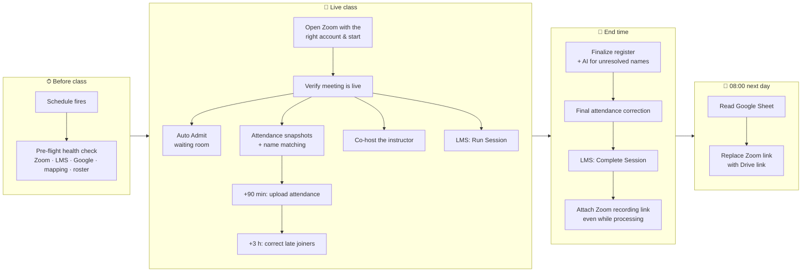
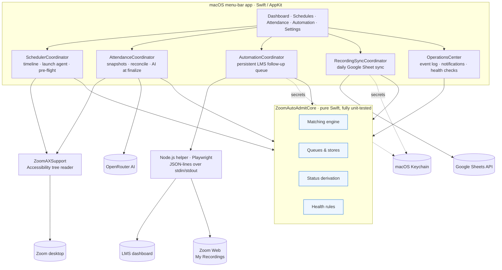

<div align="center">

# Zoom Auto Admit

### An autonomous operations platform for live online classes

**Zoom → Attendance → LMS → Recordings, end to end, with no one at the keyboard.**


[Lifecycle](docs/LIFECYCLE.md) · [Architecture](docs/ARCHITECTURE.md) · [User guide](docs/USER-GUIDE.md) · [Web extension](web-extension/README.md) · [Releases](../../releases)

</div>

---

## The problem

A training coordinator running several cohorts a day repeats the same manual loop for every class:

open the right Zoom account → start the meeting → admit every late student from the waiting room → make the instructor co-host → take attendance by comparing messy Zoom names against the official roster → type it into the LMS → fix it again for late joiners → end the session → find the cloud recording → paste its link → replace it with the Drive copy the next day.

That is **~15 error-prone steps per class, across multiple Zoom accounts, LMS screens and a Google Sheet**, while the class is live.

## The solution

Zoom Auto Admit runs the entire class lifecycle on its own from the macOS menu bar. It drives the **native Zoom app through the Accessibility API** (no screen coordinates, no screenshots), automates the **LMS dashboard with Playwright**, reconciles attendance with a **deterministic + AI name-matching engine**, pulls **Zoom cloud recordings**, syncs **Google Drive links from Google Sheets**, and reports everything on an **operations dashboard** with smart notifications and pre-flight health checks.

It is in daily production use for real cohorts.

<div align="center">

| | |
|:--|:--|
| **~27,000** lines of Swift, Node.js & JavaScript | **460+** automated tests (439 Swift · 24 Node) |
| **3** runtimes: native macOS app · Playwright helper · Chrome/Edge extension | **0** third-party dependencies in the Swift core |
| **~15** manual steps per class → **0** | Persistent retry queue that **survives restarts** |

</div>

---

## One class, fully automated



Every arrow is automatic. Every write to an external system is **read back and verified**. Every step that can fail is **queued on disk and retried**. → Full walkthrough: [docs/LIFECYCLE.md](docs/LIFECYCLE.md)

---

## Features

### 🎥 Zoom automation, native, focus-safe
- **Auto Admit** via macOS Accessibility: presses *Admit All* / *Admit* by reading Zoom's UI tree, never by coordinates or screenshots; works while Zoom is in the background.
- **Scheduled meetings** with saved Zoom account profiles: switches to the right account, handles the pre-join preview (mic/camera off), starts the meeting and **proves it is live** before anything else runs.
- **Automatic co-host** for each group's instructors, confirmed from Zoom's participant list, with bounded retries.
- **Zoom Web engine** for overlapping classes: a second meeting runs in a Playwright-driven browser profile when the desktop app is busy.
- **Launch Agent** reopens the app before scheduled meetings even after it was quit.

### 🧑‍🎓 Attendance intelligence
- **Periodic participant snapshots**, plus extra snapshots right after admissions; evidence only accumulates, a missed read never removes anyone.
- **Layered name matching:** exact → learned aliases → Arabic/Latin normalization → token and fuzzy similarity (Jaro-Winkler, Levenshtein) → **AI (OpenRouter) only for what is still unresolved**.
- **Strict one-to-one assignment:** one Zoom name can never mark two students; a student who joins twice under different names (phone + laptop) is one attendee.
- **Honorific-aware** ("Dr", "Eng", "م.") and device-name aware ("Ahmed's iPhone" is never auto-accepted).
- **Learns aliases** only from confirmed matches, so the register gets faster every week.
- **Global ignore list** for staff plus an **unknown-participant detector** (*Ignore permanently · Ignore this meeting · Add as student*).
- Present / Needs Review / Absent, with CSV export and roster-order reports.

### 🏫 LMS automation (Playwright)
- **Run Session** when the meeting goes live, **attendance upload** at +90 min, **late-joiner correction** at +3 h (only rows that differ, then reload & verify).
- **Complete Session** at the scheduled end time, never *Cancel Session*.
- **Guard rails:** exact group-code matching (G1 never matches G10), session chosen by date + scheduled time, refuses to submit when most names don't belong to that session (another group's register), refuses groups that share an LMS code.
- **Rehearse mode:** runs every step end to end and reports the decision without pressing anything that writes.

### 🎬 Recording pipeline
- **Zoom cloud recordings:** finds the class recording in Zoom Web *My Recordings* by group, date and time window, validated against the start time embedded in the share link, and copies its share link **even while Zoom is still processing**.
- **Google Sheets sync** (OAuth 2.0 + PKCE, read-only scope): every day at 08:00 Cairo, Drive links from the recordings sheet replace the temporary Zoom links on the LMS.
- Idempotent state machine per session (`pending → processing → attached / conflict / failed`), persisted locally; the sheet is never modified.

### 📊 Operations center
- **Operations Dashboard:** one card per class (Zoom, attendance, LMS, recording status, students present, next action, last success, last error), derived live from the system's stores with no duplicated state.
- **Smart notifications:** only important events, repeats grouped into one updating notification, a success clears a class's failures, and clicking opens that class.
- **Pre-flight health checks** 30 and 5 minutes before class, or on demand: Zoom install/account/Accessibility, LMS login and session existence, Google token and spreadsheet, recording sync, disk space, helper runtime. Report-only, never blocks a class.
- Notification history and a 30-day event log.

### 🌐 Chrome / Edge extension
A Manifest V3 companion for hosts on the Zoom Web Client: auto-admit, roster import, attendance capture, local matching, optional AI, CSV export. Its admit/attendance script is also reused by the macOS app's Zoom Web engine. → [web-extension/](web-extension/README.md)

---

## Architecture



- **Separation of concerns.** All decisions (matching, scheduling, retry policy, status derivation, health rules, notification throttling) live in a pure Swift library with no UI and no I/O side effects, which makes them deterministic and testable against fixed dates.
- **Process isolation.** Browser automation runs in a child Node.js process over a JSON-lines protocol. Credentials travel on stdin (never argv), and a crash in the helper can never take down Auto Admit or the attendance register.
- **Crash-safe by design.** Follow-up steps, recording sync state, attendance registers and scheduler deadlines are persisted atomically; an interrupted class resumes after a relaunch, and abandoned registers are finalized at their scheduled end.

→ Deep dive: [docs/ARCHITECTURE.md](docs/ARCHITECTURE.md)

---

## Engineering highlights

| Challenge | Approach |
|---|---|
| Automate a closed desktop app without an API | Read Zoom's live **Accessibility tree**, match controls by stable identifiers and state text, and verify outcomes from the UI instead of trusting action return codes. |
| Messy real-world names (Arabic/English, typos, titles, devices, duplicates) | Multi-stage matcher with **greedy one-to-one assignment**, duplicate-identity folding, and AI restricted to unresolved names behind validation and confidence thresholds. |
| Writes to systems we don't own must never be wrong | **Read-before-write, read-after-write** verification; whole-code session matching; cross-group plausibility check; conflicts are never auto-resolved. |
| Steps that run hours after the class started | Durable **file-backed queue** with ordering (Run Session → attendance → correction → Complete → recording), retry budgets, and postponement that doesn't burn attempts. |
| Zoom share links while a recording is still processing | Fall back to the recording's share dialog and validate the embedded start time before attaching. |
| Operator trust | Derived-state **dashboard**, grouped notifications, pre-flight checks, **rehearse mode**, and a 30-day event log. |
| Secrets | LMS password, Google refresh token and AI key live in the **macOS Keychain**; Google uses **OAuth 2.0 + PKCE** with a loopback redirect and a read-only scope. |

---

## Tech stack

| Layer | Technologies |
|---|---|
| macOS app | Swift 5.9, AppKit (programmatic UI), ApplicationServices / Accessibility API, UserNotifications, Network.framework (OAuth loopback), Security (Keychain), LaunchAgents |
| Automation helper | Node.js 20+, Playwright (persistent Chrome profiles), ExcelJS |
| Browser extension | JavaScript, Chrome/Edge Manifest V3 |
| Integrations | Zoom desktop & Web, LMS dashboard, Google Sheets API v4, OpenRouter |
| Quality | XCTest (439 tests), `node:test` (24 tests), GitHub Actions release workflow |

---

## Repository layout

```text
Sources/
  ZoomAXSupport/        Accessibility access to Zoom: participants, waiting room, menus, pre-join, co-host
  ZoomAutoAdmitCore/    Pure logic: matching, scheduling, LMS queue, recording sync, OAuth, operations
  ZoomAutoAdmitApp/     Menu-bar app: coordinators, dashboard, windows
  AutoAdmit/, InspectZoom/  CLI tools for monitoring and inspecting Zoom's UI tree
automation/             Node.js + Playwright helper (LMS, Zoom recordings, Excel, Zoom Web)
web-extension/          Chrome / Edge MV3 extension
Tests/                  XCTest suites for all three Swift modules
docs/                   Lifecycle, architecture and the full user guide
```

---

## Getting started

```bash
# 1. Build and bundle the app (installs the Node helper's packages)
./Scripts/build-app.sh release

# 2. Install
ditto "dist/Zoom Auto Admit.app" "/Applications/Zoom Auto Admit.app"
open "/Applications/Zoom Auto Admit.app"

# 3. Run the tests
swift test
cd automation && npm test
```

Requirements: macOS 13+, Zoom Workplace, Node.js 20+ and Google Chrome for the automation features. Grant Accessibility access in *System Settings → Privacy & Security → Accessibility*. Everything else (schedules, groups, LMS sign-in, Google, AI key) is configured inside the app. → [docs/USER-GUIDE.md](docs/USER-GUIDE.md)

---

## Privacy & safety

- Runs entirely on the operator's Mac. No backend server, no telemetry.
- Only unresolved names ever leave the machine, and only if an AI key is configured.
- Never ends a Zoom meeting, never presses Deny/Remove/Cancel, never overwrites a record link it didn't write.

---

<div align="center">

Built by **[Mohamed Hosam](https://github.com/Mo7amed7osam)** · Windows edition contributed by Mohab Mohamed

</div>
