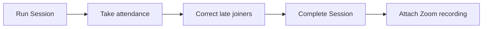
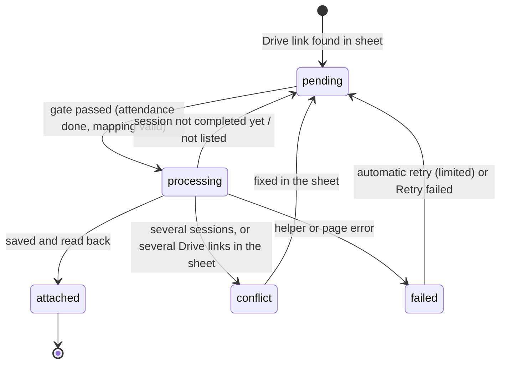

# Architecture

← [Back to README](../README.md) · [Lifecycle](LIFECYCLE.md) · [User guide](USER-GUIDE.md)

ClassFlow Automation is three cooperating runtimes on one Mac, with no backend server:

| Runtime | Language | Responsibility |
|---|---|---|
| **Menu-bar app** | Swift / AppKit | Scheduling, Zoom control through Accessibility, attendance, queues, dashboard, notifications |
| **Automation helper** | Node.js + Playwright | Browser work: LMS dashboard, Zoom Web recordings, Zoom Web meetings, Excel parsing |
| **Web extension** | JavaScript (MV3) | Auto-admit and attendance inside the Zoom Web Client; its content script is reused by the helper |

---

## Module map

```mermaid
flowchart LR
    subgraph ZoomAXSupport["ZoomAXSupport"]
        P[Participants & waiting room reader]
        MB[Menu bar & account menu]
        PJ[Pre-join preview]
        CH[Co-host actions]
    end
    subgraph Core["ZoomAutoAdmitCore (pure)"]
        SC[Scheduling<br/>timeline · launch agent]
        AT[Attendance<br/>normalizer · matcher · reconciler · AI · aliases · ignore list]
        LM[LMS<br/>client · follow-up queue · group mapping]
        RS[Recordings<br/>Google OAuth · Sheets parser · sync planner & gate]
        OP[Operations<br/>event log · status derivation · health rules · notification throttle]
        WF[Workflow<br/>meeting start state machine · pre-flight]
    end
    subgraph App["ZoomAutoAdmitApp"]
        SCO[SchedulerCoordinator]
        ACO[AttendanceCoordinator]
        AUC[AutomationCoordinator]
        RSC[RecordingSyncCoordinator]
        OPC[OperationsCenter]
        WIN[Dashboard · Schedules · Attendance · Automation · Settings windows]
    end
    App --> Core
    App --> ZoomAXSupport
    Core --> ZoomAXSupport
```



**Rule of thumb:** coordinators own threads, timers and I/O; everything that *decides* is a pure function in `ZoomAutoAdmitCore` with a unit test against fixed inputs and dates.

---

## Concurrency model

| Queue / owner | Work |
|---|---|
| Main thread | AppKit UI only |
| Workflow queue | Meeting start state machine (one at a time, lock-guarded) |
| Attendance queue | Snapshot timer, reconciliation, register persistence |
| Dashboard queue | LMS follow-ups, serialized so the dashboard is never driven twice at once |
| Roles queue | Co-host pass every 20 s |
| Recording-sync queue | Daily sheet sync |
| Health queue | Pre-flight checks and the 30-minute network checks |

Cross-process safety: every browser profile is guarded by an **exclusive lock file** holding the owner PID (stale locks from crashed processes are taken over) and by Chromium's own `SingletonLock`, so two automations can never drive the same signed-in profile.

---

## Helper protocol

The app runs `node bin/zaa-automation.mjs <command>` as a child process.

```text
stdin   → one JSON request                   (credentials travel here, never in argv)
stdout  ← {"type":"log","level":"info","message":"…"}
        ← {"type":"event","name":"admitted","data":{…}}     long-running commands
        ← {"type":"result","success":true,…}                exactly once, last
```

| Command | Purpose |
|---|---|
| `lms-run-session` / `lms-take-attendance` / `lms-correct-attendance` | Class-time LMS steps |
| `lms-end-session` | Complete Session at the end time |
| `zoom-recording-to-lms` | Read the Zoom share link, then write it to the session |
| `lms-sync-record-link` | Google Drive link from the sheet |
| `lms-check-session` | Read-only health check |
| `web-meeting` | A meeting in the Zoom Web Client with admit + attendance events |
| `read-timetable` / `read-roster` | Excel imports |

Error text from Playwright is never forwarded verbatim (it can quote typed values); only the failing step's name is.

---

## Persistence

All state lives under `~/Library/Application Support/Zoom Auto Admit/`, written atomically:

| File | Contents |
|---|---|
| `schedules.json` | Account profiles, schedules, groups, rosters, aliases, co-host candidates |
| `Attendance/<id>.json` | One register per class: roster snapshot, observations, snapshots, records |
| `LMS/follow-up.json` | Durable queue of LMS steps with due time, attempts and last error |
| `RecordingSync/records.json` | Per-session recording state machine |
| `Operations/events.jsonl` | 30-day append-only event log (dashboard history, notifications) |
| `ignored-participants.json` | Global staff ignore list |
| `Profiles/<name>/` | Persistent browser profiles (LMS, one per Zoom account) |

A data file that no longer decodes is copied aside before anything overwrites it.

Secrets are **not** in these files: the LMS password, Google refresh token and client secret, and the OpenRouter key are stored in the **macOS Keychain**.

---

## Key state machines

### Follow-up queue ordering



A step postpones itself (without spending an attempt) while an earlier step for the same class is still owed. Failures retry with a budget; recording steps wait until the next morning's hand-over to the Drive sync.

### Recording sync record



---

## Design decisions

- **Accessibility, not pixels.** Zoom controls are located by `AXIdentifier` and state text, duplicates in Zoom's self-nesting toolbar are collapsed, and outcomes are verified from the UI because Zoom's action return codes are unreliable.
- **Verify every external write.** LMS attendance, session completion and record links are all re-read after a reload before a step is marked done.
- **Never guess.** A session is matched by whole group code; ambiguity becomes a reported state, not a choice.
- **Derived, not duplicated, status.** The dashboard computes each card from the scheduler, registers, queue and sync store at render time; the event log only adds outcomes no store keeps.
- **Quiet by default.** Notifications are throttled per class and kind, escalate only when things get worse, and clear on success.
- **Degrade, don't stop.** Health checks report but never block; an unavailable AI or helper leaves local results intact.

---

## Testing

| Suite | Scope |
|---|---|
| `ZoomAXSupportTests` (89) | Accessibility tree parsing against captured Zoom hierarchies |
| `ZoomAutoAdmitCoreTests` (323) | Matching, reconciliation, scheduling timeline, queue, recording sync, OAuth/PKCE, health rules, dashboard derivation, notification throttling |
| `ZoomAutoAdmitAppTests` (27) | Window wiring, groups editor, attendance lifecycle wiring |
| `automation/test` (24) | Session row selection, attendance plans, cross-group guard, link rules, Excel parsing, recording selection |

```bash
swift test
cd automation && npm test
```
