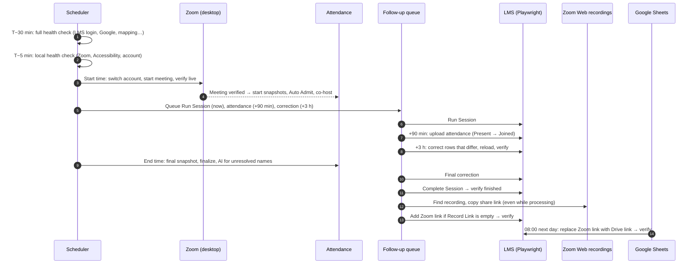

# The Class Lifecycle

What ClassFlow Automation does for one scheduled class, from the minutes before it starts to the next morning. Every step below runs without an operator.

← [Back to README](../README.md) · [Architecture](ARCHITECTURE.md) · [User guide](USER-GUIDE.md)

---

## 1 · Before the class

**Scheduler.** Each schedule carries its group, the group's LMS code, a Zoom account profile, the meeting ID or link, recurrence, start and end time. The timeline is evaluated as intervals rather than "is it time yet?", so a tick delayed by sleep or a relaunch still catches its occurrence. A LaunchAgent reopens the app before meetings if it was quit.

**Pre-flight health check.**

| When | Checks |
|---|---|
| 30 min before | LMS sign-in works and the session is listed for that date · Google token valid and the spreadsheet has the group's tab |
| 5 min before | Zoom installed · Accessibility granted · the right Zoom account is signed in · meeting can start · attendance group and roster present · disk space · helper runtime |
| On demand | Everything above, from the dashboard |

Problems are **reported, never blocking**: a class always starts.

## 2 · Class start

1. Switch Zoom to the schedule's account, handle the pre-join preview (microphone and camera off), start the meeting.
2. **Prove the meeting is live** from Zoom's own UI before anything else runs.
3. Start Auto Admit, attendance snapshots and the co-host watcher.
4. Queue the LMS steps on disk: **Run Session** (due now), **take attendance** (+90 min), **correct late joiners** (+3 h).

## 3 · During the class

**Auto Admit** presses *Admit All* / *Admit* through the Accessibility tree whenever someone is waiting.

**Attendance** snapshots the participant list periodically and shortly after admissions. If Zoom's Participants panel is unreadable, a watchdog reopens it through Zoom's menu and warns once. Staff on the ignore list and the group's co-hosts are kept out of the register. Matching runs in layers:

| Layer | Example |
|---|---|
| Exact | `Mona Samir` = `Mona Samir` |
| Learned alias | `amir abdu` → *Amir Girges Abdou Girges* |
| Normalization | Arabic letter forms, diacritics, punctuation, role tags, titles (`Dr`, `Eng`, `م.`) |
| Token / fuzzy | Jaro-Winkler and Levenshtein with middle-name tolerance |
| AI (OpenRouter) | Only unresolved students and unclaimed Zoom names, validated, thresholded |

Assignment is **one-to-one**: one Zoom identity never marks two students, and a student's second identity (a rejoin, a second device) is folded into the same student.

**Co-host.** The group's instructors are made co-host through the participant row's menu and confirmed from the list, with a bounded number of attempts.

## 4 · Attendance upload (+90 min)

1. Sign in, open the day's sessions, open the session by **exact group code + date + scheduled time**.
2. Build the plan: **Present → Joined**, everyone else the LMS lists → **Not Joined** (Needs Review stays Not Joined until a person decides).
3. **Refuse** if most present names are not on this session: that is another group's register.
4. Tick every row and submit; if any row cannot be ticked, nothing is submitted.

## 5 · Late-joiner correction (+3 h)

Open *View details*, compare with the local register, flip **only the rows that differ**, reload, and verify each row by name.

## 6 · Class end (scheduled end time, the source of truth)

1. Final snapshot, finalize the register: unseen students become **Absent**.
2. **AI matching** for anything still unresolved; confident matches become Present and are learned as aliases.
3. Final attendance correction to the LMS.
4. **Complete Session** (never *Cancel Session*), then reload and confirm the session reads finished / offers *Add Record Link*.

The Zoom meeting itself is never ended by the app.

## 7 · Recording

1. Open Zoom Web *My Recordings* with the class account's profile.
2. Pick the recording by **group name + date + time window**, choosing the longest when a class was restarted, and validate against the start time embedded in the share link.
3. Copy its share link; **while the recording is still processing**, use the share dialog's *Copy link*.
4. If the LMS *Record Link* is empty, save it and read it back.

Not listed yet? Retried every 30 minutes until 08:00 the next morning, then the Drive sync takes over.

## 8 · Drive replacement (08:00 Cairo, daily)

1. Read the recordings Google Sheet (read-only): each tab is a group code, rows give date and Drive link.
2. For each new link, wait until that class's attendance is finished, its register finalized, and its LMS session completed.
3. On the session's *Record Link*:

| Current value | Action |
|---|---|
| Empty | Add the Drive link |
| The same Drive file | Already done |
| The Zoom recording link | Replace with the Drive link |

4. Reload and verify. Progress is stored per session; the sheet is never written.

## 9 · Failure handling

| Failure | Behaviour |
|---|---|
| LMS timeout, sign-in or page error | Step stays queued, retried every 15 min (up to 8 attempts), notification grouped |
| Recording not ready | Retried every 30 min until 08:00, one notification if still missing |
| Wrong or shared group mapping | Step postponed and reported, never guessed |
| Sheet unavailable | Reported; retried on the next run or *Sync now* |
| App quit or Mac restarted mid-class | Register resumed from disk; queued steps run when the app is back |

Every failure appears on the **Operations Dashboard** and in the notification history.
